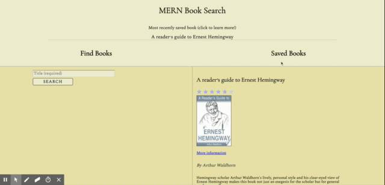

# React Books

React Books is a MERN-stack application for searching Google Books API and performing CRUD operations using Mongoose. Whenever a user saves a book, web sockets update the most recently saved book in realtime.



## Technologies used

- MERN (Mongoose, Express, React, Node)
- Socket.io
- Axios
- CSS Grid and Flexbox

## Starting the app locally

Git clone and while in the root directory, run the following command:

```
npm install
```

This should install node modules within the server and the client folder.

After both installations complete, run the following command in your terminal:

```
npm start
```

Your app should now be running on <http://localhost:3000>. The Express server should intercept any AJAX requests from the client.
